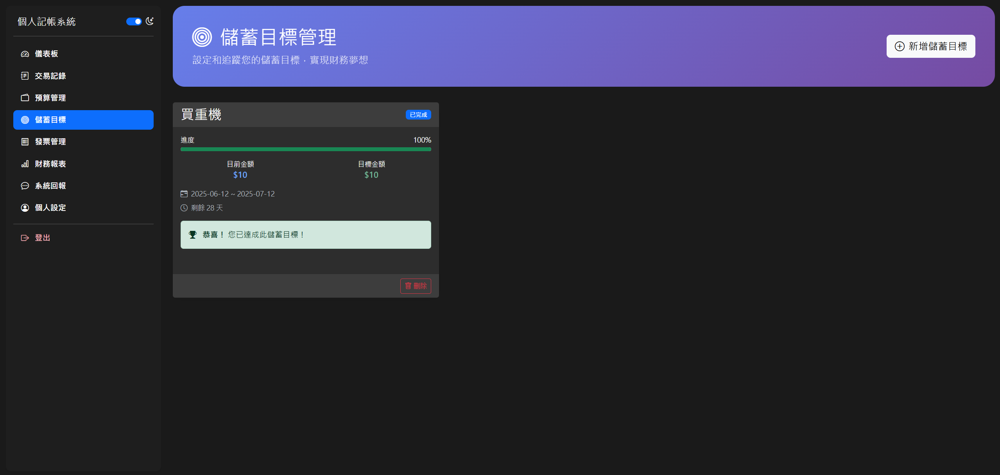

# 記帳管理系統(Web)

一個功能完善的個人財務追蹤與管理系統，提供交易記錄、預算規劃、發票管理、儲蓄目標設定等功能，支援深色/淺色模式切換。


## 系統展示影片

觀看我們的系統 DEMO 影片，了解系統的完整功能與操作流程：

[](https://youtu.be/NOTtFg97ZWU)

[點擊這裡觀看完整影片](https://youtu.be/NOTtFg97ZWU)

## 功能特色

### 用戶功能
- **儀表板**：一目了然地查看財務狀況、最新交易記錄與收支趨勢圖表
- **交易管理**：記錄收入與支出，自訂分類，附加備註說明
- **預算規劃**：設定月度支出預算，自動追蹤實際花費與剩餘額度
- **發票管理**：記錄電子發票資訊，自動與交易記錄整合
- **儲蓄目標**：設定財務目標，追蹤進度，管理儲蓄計畫
- **財務報表**：依月份查看收支統計，分析消費模式與趨勢
- **意見回饋**：向系統管理者提交問題報告或功能建議
- **個人設定**：管理個人資料與總資產設定

### 管理者功能
- **系統總覽**：查看整體系統使用狀況與用戶活動
- **黑名單管理**：管理系統不當使用者，封鎖違規帳號
- **用戶回饋處理**：查看與管理用戶提交的問題與建議
- **用戶監控**：監控用戶的交易活動和系統使用情況
- **系統安全維護**：管理可疑行為與異常活動
- **系統報表分析**：查看系統使用統計與效能分析

## 管理者後台

管理者後台為系統管理員提供全面的系統管理工具：

1. **管理者儀表板**
   - 系統使用數據統計
   - 用戶活動監控
   - 黑名單用戶數量統計
   - 即時系統狀態監控

2. **用戶管理**
   - 查看用戶列表
   - 封鎖違規用戶
   - 解除用戶封鎖
   - 用戶權限管理

3. **問題回報處理**
   - 查看用戶提交的回饋與問題報告
   - 回應用戶問題
   - 標記問題狀態（待處理/已解決）
   - 分類處理用戶建議

4. **系統安全**
   - 異常登入監控
   - 可疑行為檢測
   - 安全日誌查看

## 管理者與用戶介面對比

| 功能 | 一般用戶 | 管理者 |
|------|---------|--------|
| 儀表板 | 個人財務儀表板 | 系統使用總覽儀表板 |
| 數據查看 | 僅自己的數據 | 全系統用戶數據 |
| 用戶管理 | 僅管理自己帳號 | 可管理所有用戶帳號 |
| 黑名單功能 | 無 | 可進行封鎖與解除封鎖 |
| 回饋處理 | 提交回饋 | 處理用戶回饋 |

## 技術實現

- **前端**：HTML5, CSS3, JavaScript, Bootstrap 5
- **後端**：PHP
- **資料庫**：MySQL
- **版本控制**：Git
- **佈署環境**：AWS RDS, Apache

## 系統特點

1. **響應式設計**：在手機、平板和桌面裝置上均有良好的使用體驗
2. **深色/淺色模式**：根據用戶偏好自動切換或手動選擇
3. **直覺式界面**：簡潔、易用的使用者界面，降低學習門檻
4. **資料視覺化**：透過圖表清晰呈現財務資訊
5. **即時反饋**：操作後立即顯示提示訊息
6. **安全性考量**：用戶驗證、輸入資料驗證、黑名單機制等安全措施
7. **個性化設定**：可依需求調整顯示內容
8. **雙角色系統**：區分一般用戶與管理者權限，確保系統安全

## 安裝指南

### 系統需求
- PHP 7.4+
- MySQL 5.7+
- Web伺服器 (Apache/Nginx)

### 安裝步驟

1. 克隆儲存庫
   ```
   git@github.com:joshu0601/Database_G04_Web.git
   ```

2. 建立資料庫並匯入結構
   ```
   mysql -u username -p < database_structure.sql
   ```

3. 配置資料庫連線
   - 編輯檔案中的資料庫連線參數

4. 將檔案放置於網頁伺服器目錄下

5. 訪問系統並建立管理員帳號

## 管理者帳號設定

首次安裝系統後，您需要設定管理者帳號：

1. 在登入頁面選擇「管理者」登入模式
2. 使用預設管理者帳號登入（預設帳號: admin, 密碼: adminpass）
3. 登入後立即變更預設密碼以確保系統安全
4. 在管理者後台設定其他所需的系統參數

## 使用截圖

### 用戶界面




### 管理者界面


## 影片導覽

以下是系統各主要功能的操作示範影片：

1. [用戶登入與儀表板操作](https://youtu.be/NOTtFg97ZWU?t=25) - 了解如何登入系統並使用儀表板
2. [交易記錄管理](https://youtu.be/NOTtFg97ZWU?t=95) - 學習如何新增、編輯和管理交易記錄
3. [預算設定與追蹤](https://youtu.be/NOTtFg97ZWU?t=180) - 掌握預算管理功能
4. [發票整合功能](https://youtu.be/NOTtFg97ZWU?t=240) - 電子發票管理與整合示範
5. [管理者功能展示](https://youtu.be/NOTtFg97ZWU?t=350) - 查看管理者介面與功能操作


